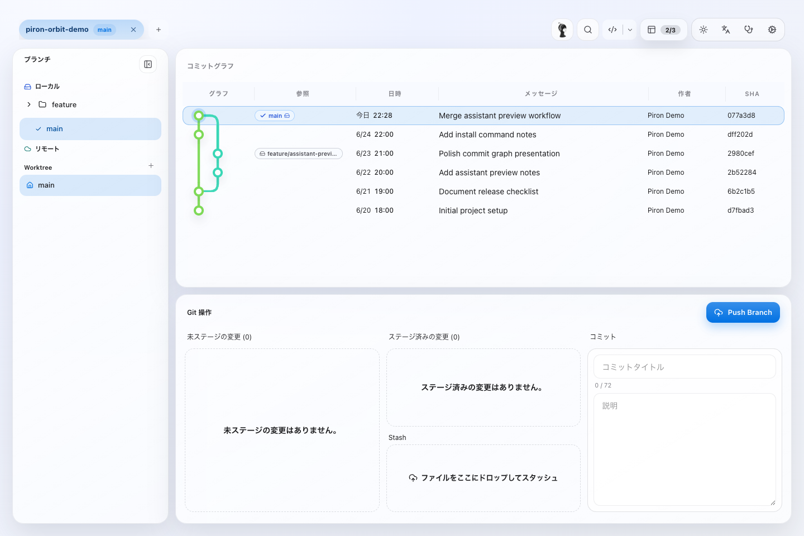

# homebrew-tap

Homebrew tap for Piron Orbit.

## Piron Orbit

Piron Orbit is distributed as a macOS arm64 Homebrew Cask.



### Install

```bash
brew tap yuyakinjo/tap
brew trust yuyakinjo/tap
brew install --cask piron-orbit
```

### Update

```bash
brew update
brew upgrade --cask piron-orbit
```

### Uninstall

```bash
brew uninstall --cask piron-orbit
```

To also remove app support files:

```bash
brew uninstall --cask --zap piron-orbit
```

### macOS Security

Piron Orbit builds in this tap are arm64-only and intended for personal use. If macOS blocks the app because the build is not notarized, remove the quarantine attribute after installation:

```bash
xattr -dr com.apple.quarantine "/Applications/Piron Orbit.app"
```
